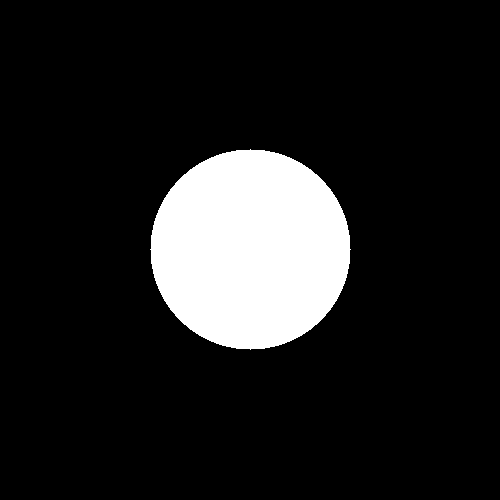
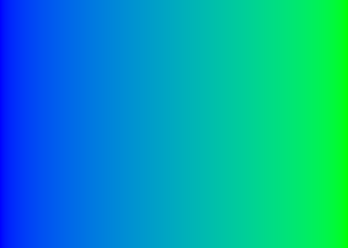

## Projet Worshop de Gala Rachedi

# Ne garde que le vert

```cpp
void only_green(sil::Image& image)
{
    for (glm::vec3& color : image.pixels())
    {
         color.r = 0.f;
        color.b = 0.f;
    }
}
```


# Echanger les canaux

Premier bug
```cpp
void exchange_color_bug(sil::Image& image)
{
        for (glm::vec3& color : image.pixels())
    {
        color.r = color.g;
        color.b = color.r;
        color.g = color.b;
    }
}
```
Le programme ne fonctionne pas car d'abord on remplace la composante du rouge par celle du vert puis celle du bleu par celle du rouge mais celle-ci étant déjà remplacée par la composate du vert. <br>
De même pour la composante du vert. Au final tous les canaux ont les memes composantes, on a donc une image en nuances de gris.


```cpp
void exchange_color(sil::Image& image)
{
        for (glm::vec3& color : image.pixels())
    {
        color = glm::vec3{color.g,color.b,color.r};  
    }
}
```
On fait attention à ce que les couleurs ne se remplacent pas lors de l'échange. 


Autre version en utilisant les swap
```cpp
void exchange_color2(sil::Image& image)
{
        for (glm::vec3& color : image.pixels())
    {
        std::swap(color.b,color.r);  
        std::swap(color.b,color.g);
    }
}
```


# Noir et blanc

```cpp
void noir_et_blanc(sil::Image& image)
{
        for (glm::vec3& color : image.pixels())
    {
        float grey = 0.299*color.r + 0.587*color.g + 0.114*color.b;
        color = glm::vec3{grey};
    }
}
```


# Negatif

```cpp
void negatif(sil::Image& image)
{
        for (glm::vec3& color : image.pixels())
    {
        color = glm::vec3{1-color.r, 1-color.g, 1-color.b};
    }
}
```


# Degradé

```cpp
void degrade(sil::Image& image)
{
    for (int x{0}; x < image.width(); ++x)
    {
        for (int y{0}; y < image.height(); ++y)
        {
            image.pixel(x, y) = glm::vec3{static_cast<float>(x) / static_cast<float>(image.width() - 1)};
        }
    }
}
```


# Miroir

```cpp
void mirror_bug(sil::Image& image)
{
    for (int x{0}; x < image.width(); x++)
    {
        for (int y{0}; y < image.height(); y++)
        {
            image.pixel(x,y).r= image.pixel(image.width() - (1+x),y).r;
            image.pixel(x,y).g= image.pixel(image.width() - (1+x),y).g;
            image.pixel(x,y).g= image.pixel(image.width() - (1+x),y).g;
        }
    }
}
```


Erreur d'innatention mais rendu plutot mignon

```cpp
void mirror_bug2(sil::Image& image)
{
    for (int x{0}; x < image.width(); x++)
    {
        for (int y{0}; y < image.height(); y++)
        {
            image.pixel(x,y)= image.pixel(image.width() - (1+x),y);
        }
    }
}
```


Seul la moitié est modifiée car la moitié de droite est modifiée deux fois et reviens ainsi à l'origine.

```cpp
void mirror_bug3(sil::Image& image)
{
    for (int x{0}; x < image.width(); x++)
    {
        for (int y{0}; y < image.height(); y++)
        {
            std::swap(image.pixel(x,y),image.pixel(image.width() - (1+x),y));
        }
    }
}
```
Ne change toujours rien car les moitiés droites et gauches sont échangées deux fois puisque x parcout toute la width.
```cpp
void mirror(sil::Image& image)
{
    for (int x{0}; x < image.width()/2; x++)
    {
        for (int y{0}; y < image.height(); y++)
        {
            std::swap(image.pixel(x,y),image.pixel(image.width() - (1+x),y));
        }
    
    }
}
```
Je divise la width par deux ce qui empêche les pixels de droite d'être les mêmes que ceux de gauche.


# Image bruitée

```cpp
void bruit(sil::Image& image)
{
    for (glm::vec3& color : image.pixels())
    {
        if (true_with_probability(0.3))
        {
            color = glm::vec3{random_float(0, 1), random_float(0, 1), random_float(0, 1)};
        }
        
    }
}
```


# Rotation de 90°

```cpp
void rotation90_bug(sil::Image& image)
{
    for (int x{0}; x < image.width(); x++)
    {
        for (int y{0}; y < image.height()/2; y++)
        {
            std::swap(image.pixel(x,y),image.pixel(y,x));
        }
    
    }
}
```


Même problème que pour le mirroir, l'image se modifie elle même, il faut utiliser une nouvelle image.

```cpp
void rotation90(sil::Image& image)
{
    sil::Image new_image{image.height(),image.width()};
    for (int x{0}; x < new_image.width(); x++)
    {
        for (int y{0}; y < new_image.height(); y++)
        {
            new_image.pixel(x,y)=image.pixel(y,image.height()-x-1);
        }
    
    }
    image = new_image;
}
```


# RGB split

```cpp
void rgbsplit(sil::Image& image)
{
    sil::Image new_image{image.width(),image.height()};
    int vib{10};
    for (int x{0}; x < image.width(); x++)
    {
        for (int y{0}; y < image.height(); y++)
        {

            new_image.pixel(x,y).r=image.pixel(std::max(x-vib,0),y).r;
            new_image.pixel(x,y).g=image.pixel(x,y).g;
            new_image.pixel(x,y).b=image.pixel(std::min(x+vib,image.width()-1),y).b;
        }
    }
    image = new_image;
}
```
La variable vib défini le niveau de vibration de l'image. <br>
Afin de ne pas assigner des valeurs negatives pour x et au dessus de la width  pour y j'utilise les fonctions max et min.


# Luminosité

```cpp
void luminosite(sil::Image& image)
{
    float exp{0.5};
    for (glm::vec3& color : image.pixels())
    {
        color.r = pow(color.r,exp);
        color.b = pow(color.b,exp);
        color.g = pow(color.g,exp);
    }
}
```


# Disque

```cpp
void disquev1(sil::Image& image)
{
    int r{100};
    for (int x{0}; x < image.width(); x++)
    {
        for (int y{0}; y < image.height(); y++)
        {
            if ((pow(x-250,2)+pow(y-250,2))<=pow(r,2))
            {
                image.pixel(x,y)=glm::vec3{1};
            }
        }

    }
}
```
L'équation d'un disque étant : 
$$
(x-xc)² + (y-yc)² <= r²
$$
avec (x,y) coordonnées du disque, (xc,yc) coordonnées du centre et r le rayon du disque. On colorie donc les pixels à l'intérieur appartenant au disque. <br>
Version plus générale :
```cpp
void disque(sil::Image& image)
{
    int r{100};
    std::vector centre{image.width()/2,image.height()/2};
    for (int x{0}; x < image.width(); x++)
    {
        for (int y{0}; y < image.height(); y++)
        {
            if ((pow(x-centre[0],2)+pow(y-centre[1],2))<=pow(r,2))
            {
                image.pixel(x,y)=glm::vec3{1};
            }
        }

    }
}
```
Je crée un vecteur ayant deux composantes, les coordonées du centre du disque.



# Cercle

```cpp
void cerclev1(sil::Image& image)
{
    int r{100};
    std::vector centre{image.width()/2,image.height()/2};
    for (int x{0}; x < image.width(); x++)
    {
        for (int y{0}; y < image.height(); y++)
        {
            if ((pow(x-250,2)+pow(y-250,2))>=pow(r-7/2,2) && (pow(x-250,2)+pow(y-250,2))<=pow(r+7/2,2))
            {
                image.pixel(x,y)=glm::vec3{1};
            }
        }

    }
}
```
Je reprend l'équation du disque en coloriant uniquement les pixels au dessus et en dessous du rayon +- l'épaisseur/2 (7/2 ici).


Version plus générale : 
```cpp
void cerclev2(sil::Image& image,float thickness,int r)
{
    std::vector centre{image.width()/2,image.height()/2};
    for (int x{0}; x < image.width(); x++)
    {
        for (int y{0}; y < image.height(); y++)
        {
            if ((pow(x-centre[0],2)+pow(y-centre[1],2))>=pow(r-thickness/2,2) && (pow(x-centre[0],2)+pow(y-centre[1],2))<=pow(r+thickness/2,2))
            {
                image.pixel(x,y)=glm::vec3{1};
            }
        }

    }
}
```
Je crée un vecteur ayant deux composantes, les coordonées du centre du cercle.<br>
J'innitialise deux variables dans les paramètres de la fonction pour l'épaisseur et la rayon du cercle.
<br>Cercle généré par :
```cpp
int main()
{
    sil::Image image{"images/"};
    cercle(image,3,200);
    image.save("output/pouet.png");
}
```


# Animation

```cpp
void animation(sil::Image& image)
{
    std::vector centre{0,image.height()/2};
    int r{100};
    for (int i = 0; i < 60; i++)
    {
        image = sil::Image{image.width(),image.height()};
        for (int x{0}; x < image.width(); x++)
        {
            for (int y{0}; y < image.height(); y++)
            {
                if ((pow(x-centre[0],2)+pow(y-centre[1],2))<=pow(r,2))
                {
                    image.pixel(x,y)=glm::vec3{1};
                }
            }
        }
        image.save("output/pouet.png");
        centre[0]+=image.width()/50;
    }
}
```
Pour chaque image la coordonée x du centre du disque est modifiée. On l'incrément de la width de l'image divisé par 50 pour avoir 50 frame. Le programme va enregistrer a chaque passage dans la boucle sur les images de chaque disque le ficher pouet.png ce qui va créer une animation.


# Rosace

Fonction cercle modifiée pour la rosace : 
```cpp
void cercle(sil::Image& image,float thickness,int r,std::vector<int> const& centre)
{
    for (int x{0}; x < image.width(); x++)
    {
        for (int y{0}; y < image.height(); y++)
        {
            if ((pow(x-centre[0],2)+pow(y-centre[1],2))>=pow(r-thickness/2,2) && (pow(x-centre[0],2)+pow(y-centre[1],2))<=pow(r+thickness/2,2))
            {
                image.pixel(x,y)=glm::vec3{1};
            }
        }

    }
}
```
Je rajoute le centre en argument afin de pouvoir le modifier.


```cpp

void rosace(sil::Image& image,int r,int k)
{
    std::vector centre{image.width()/2,image.height()/2};
    for (int i = 0; i < k; i++)
    {
        int centresX=centre[0] + r*cos(i*2*M_PI/k);
        int centresY=centre[1]+ r*sin(i*2*M_PI/k);
        cercle(image,5,std::vector {centresX,centresY},r);
        image.save("output/pouet.png");
    }
    
}

```
On utilise une formule trigonométrique pour trouver les différents centres de la rosace. Pour une rosace de centre (X,Y) les coordonnées des différents centres sont:
$$
x = X + rcos(\frac{2i\pi} {k}) \\
y = Y + rsin(\frac{2i\pi} {k})
$$

Je rentre le code suivant :
```cpp
int main()
{
    sil::Image image{500,500};
    rosace(image,100,6);
    image.save("output/pouet.png");
}
```


# Mosaïque

```cpp
void mosaique(sil::Image& image,int n)
{
    sil::Image mosaique{image.width(),image.height()};
    for (int x{0}; x < image.width(); x++)
    {
        for (int y{0}; y < image.height(); y++)
        {
            int a = x%(image.width()/n);
            int b = y%(image.height()/n);
            mosaique.pixel(x,y) = image.pixel(a*n,b*n);
        }
    }
    image = mosaique;
}
```
Pour avoir les coordonnées a et b de la petite image de la mosaique on utilise la formule avec le modulo.<br>
Je multiplie ensuite pas n ces nouvelles coordonnées, n étant le nombre de divisions de la width, pour remplir les pixels de la mosaique.


# Glitch

```cpp
void glitch(sil::Image& image)
{
    for (int x{0}; x < image.width()-40; x++)
    {
        for (int y{0}; y < image.height()-10; y++)
        {
            if (true_with_probability(0.001))
            {
                int Xpixel_ech= random_int(0,image.width()-40);
                int Ypixel_ech= random_int(0,image.height()-10);
                int width{random_int(0,40)};
                int height{random_int(0,10)};
                for (int u{0}; u < width; u++)
                {
                    for (int v{0}; v < height; v++)
                    {
                        std::swap(image.pixel(x+u, y+v),image.pixel(Xpixel_ech+u,Ypixel_ech+v));
                    }
                } 
            }
        }
    }
}
```


# Dégradé de couleurs

```cpp

Dégradé de deux couleurs :

void degrade2(sil::Image& image)
{
    glm::vec3 bleu{0,0,1};
    glm::vec3 vert{0,1,0};
    for (int x{0}; x < image.width(); ++x)
    {
        for (int y{0}; y < image.height(); ++y)
        {
            float mix{static_cast<float>(x) / static_cast<float>(image.width() - 1)};
            image.pixel(x, y) = glm::mix(bleu,vert,mix) ;
        }
    }
}
```
Je réutilise la formule de l'ancien dégradé en l'utilisant cette fois comme facteur de mix entre les deux couleurs.


Je vais maintenant utiliser OkLab.<br>
Pour l'utiliser il faut convertir les valeurs de nos couleurs :

Convertions de RGB vers Lab et Lab vers RGB.

```cpp
glm::vec3 lab(glm::vec3 c) 
{
    c = srgbToLinear(c);

    float l = 0.4122214708f * c.r + 0.5363325363f * c.g + 0.0514459929f * c.b;
	float m = 0.2119034982f * c.r + 0.6806995451f * c.g + 0.1073969566f * c.b;
	float s = 0.0883024619f * c.r + 0.2817188376f * c.g + 0.6299787005f * c.b;

    float l_ = cbrtf(l);
    float m_ = cbrtf(m);
    float s_ = cbrtf(s);

    return {
        0.2104542553f*l_ + 0.7936177850f*m_ - 0.0040720468f*s_,
        1.9779984951f*l_ - 2.4285922050f*m_ + 0.4505937099f*s_,
        0.0259040371f*l_ + 0.7827717662f*m_ - 0.8086757660f*s_,
    };
}


glm::vec3 rgb(glm::vec3 c) 
{

    float l_ = c.r + 0.3963377774f * c.g + 0.2158037573f * c.b;
    float m_ = c.r - 0.1055613458f * c.g - 0.0638541728f * c.b;
    float s_ = c.r - 0.0894841775f * c.g - 1.2914855480f * c.b;

    float l = l_*l_*l_;
    float m = m_*m_*m_;
    float s = s_*s_*s_;


    glm::vec3 b
    {+4.0767416621f * l - 3.3077115913f * m + 0.2309699292f * s,
		-1.2684380046f * l + 2.6097574011f * m - 0.3413193965f * s,
		-0.0041960863f * l - 0.7034186147f * m + 1.7076147010f * s,
    };
    b = linearToSrgb(b);
    return b;
}
```
OkLab utilise des valeurs en linéaire hors nos valeurs sont en srgb on va donc les convertir.<br>
Convertions de srgb vers linéaire et linéaire vers srgb.

```cpp

glm::vec3 srgbToLinear(const glm::vec3& srgbColor) {
    glm::vec3 linearColor;
    
    for (int i = 0; i < 3; ++i) 
    { 
        if (srgbColor[i] <= 0.04045f) 
        {
            linearColor[i] = srgbColor[i] / 12.92f;
        } else 
        {
            linearColor[i] = std::pow((srgbColor[i] + 0.055f) / 1.055f, 2.4f);
        }
    }
    
    return linearColor;
}

glm::vec3 linearToSrgb(const glm::vec3& linearColor) {
    glm::vec3 srgbColor;

    for (int i = 0; i < 3; ++i) 
    { 
        if (linearColor[i] <= 0.0031308f) 
        {
            srgbColor[i] = 12.92f * linearColor[i];
        } else 
        {
            srgbColor[i] = 1.055f * std::pow(linearColor[i], 1.0f / 2.4f) - 0.055f;
        }
    }

    return srgbColor;
}

```
Le dégradé de deux couleurs devient :



On remarque bien que les transitions entre les couleurs sont plus lisses ce qui est plus joli.<br>
J'ai ensuite pris l'innitiative de faire des dégradés de plusieurs couleurs.

Dégradé de trois couleurs :
```cpp
void degrade3(sil::Image& image)
{
    glm::vec3 bleu{0,0,1};
    glm::vec3 vert{0,1,0};
    glm::vec3 rouge{1,0,0};
    for (int x{0}; x < image.width(); ++x)
    {
        for (int y{0}; y < image.height(); ++y)
        {
            if (x<image.width()/2)      
            {
                float mix{static_cast<float>(x) / static_cast<float>(image.width()/2 - 1)};
                image.pixel(x, y) = rgb( glm::mix(lab(bleu),lab(vert),mix) );
            }
            else
            {
                float mix{static_cast<float>(x) / static_cast<float>(image.width()/2- 1)   -1};
                image.pixel(x, y) = rgb( glm::mix(lab(vert),lab(rouge),mix) ) ;
            }
        }
    }
}
```
Pour la deuxième moitié de l'écran on soustrait 1 au dénominateur de la variable mix pour que celle-ci reste dans l'intervalle [0,1]


Dégradé de 5 couleurs:

```cpp
void degrade5(sil::Image& image)
{
    glm::vec3 bleu{0,0,1};
    glm::vec3 cyan{0,1,1};
    glm::vec3 vert{0,1,0};
    glm::vec3 rouge{1,0,0};
    glm::vec3 jaune{1,1,0};
    for (int x{0}; x < image.width(); ++x)
    {
        for (int y{0}; y < image.height(); ++y)
        {
            if (x<image.width()/5)      
            {
                float mix{static_cast<float>(x) / static_cast<float>(image.width()/5 - 1)};
                image.pixel(x, y) = rgb( glm::mix(lab(bleu),lab(cyan),mix) );
            }
            else if (image.width()/5<=x && x<2*image.width()/5)
            {
                float mix{static_cast<float>(x) / static_cast<float>(image.width()/5- 1)   -1};
                image.pixel(x, y) = rgb( glm::mix(lab(cyan),lab(vert),mix) ) ;
            }
            else if (2*image.width()/5<=x && x<3*image.width()/5)
            {
                float mix{static_cast<float>(x) / static_cast<float>(image.width()/5- 1)   -2};
                image.pixel(x, y) = rgb( glm::mix(lab(vert),lab(jaune),mix) ) ;
            }
            else
            {
                float mix{static_cast<float>(x) / static_cast<float>(image.width()/5- 1)   -3};
                image.pixel(x, y) = rgb( glm::mix(lab(jaune),lab(rouge),mix) ) ;
            }
        }
    }
}
```
De même que pour le dégradé de 3 couleurs on soustrait à chaque dénominateur différentes valeurs pour que les facteurs de mix restent dans l'intervalle [0,1].


Puis j'ai essayé d'embellir ce dégradé :

```cpp
void degradePastel5(sil::Image& image)
{
    glm::vec3 bleu{0,0.3,1};
    glm::vec3 cyan{0,0.8,1};
    glm::vec3 vert{0,1,0.3};
    glm::vec3 jaune{1,0.8,0};
    glm::vec3 rouge{1,0.3,0};
    for (int x{0}; x < image.width(); ++x)
    {
        for (int y{0}; y < image.height(); ++y)
        {
            if (x<image.width()/5)      
            {
                float mix{static_cast<float>(x) / static_cast<float>(image.width()/5 - 1)};
                image.pixel(x, y) = rgb( glm::mix(lab(bleu),lab(cyan),mix) );
            }
            else if (image.width()/5<=x && x<2*image.width()/5)
            {
                float mix{static_cast<float>(x) / static_cast<float>(image.width()/5- 1)   -1};
                image.pixel(x, y) = rgb( glm::mix(lab(cyan),lab(vert),mix) ) ;
            }
            else if (2*image.width()/5<=x && x<3*image.width()/5)
            {
                float mix{static_cast<float>(x) / static_cast<float>(image.width()/5- 1)   -2};
                image.pixel(x, y) = rgb( glm::mix(lab(vert),lab(jaune),mix) ) ;
            }
            else
            {
                float mix{static_cast<float>(x) / static_cast<float>(image.width()/5- 1)   -3};
                image.pixel(x, y) = rgb( glm::mix(lab(jaune),lab(rouge),mix) ) ;
            }
        }
    }
}
```


# Fractale de Mandelbrot

```cpp
void fractale(sil::Image& image)
{
    for (int x{0}; x < image.width(); ++x)
    {
        for (int y{0}; y < image.height(); ++y)
        {
            std::complex<float> c{4.f/image.width()*x - 2.f,4.f/image.height()*y - 2.f};
            int iterations{};
            for (std::complex<float> z{0,0}; std::abs(z)<2 ; z=z*z+c)
            {
                iterations+=1;
                if(iterations >100)
                break;
            }
            glm::vec3 gris{iterations/100.f};
            image.pixel(x,y)=glm::vec3{gris};
            
        }
    }
}
```
A chaque passage dans la boucle la variable itérations est incrémentée. On l'utilise ainsi pour avoir un gris de plus en plus sombre lorsqu'on s'éloigne de la fractale.
Pour que les nombres complexes soient entre -2 et 2 et que la fractale en soit pas trop petite on va multiplier x et y par 4 et leur soustraire 2.

